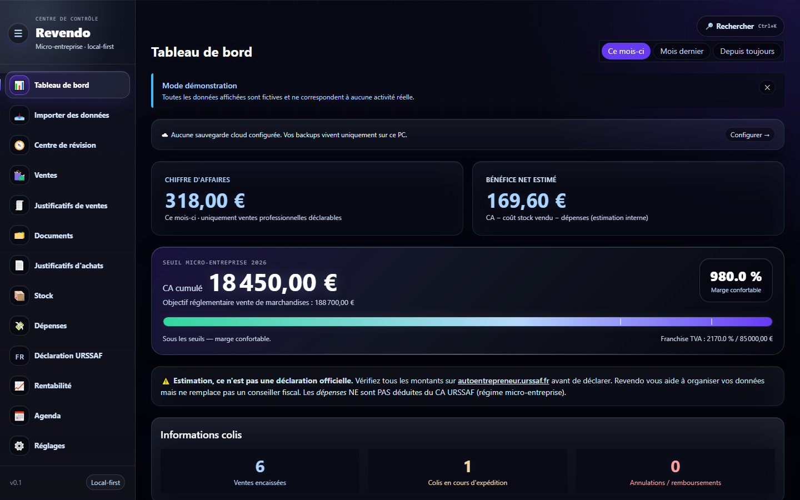
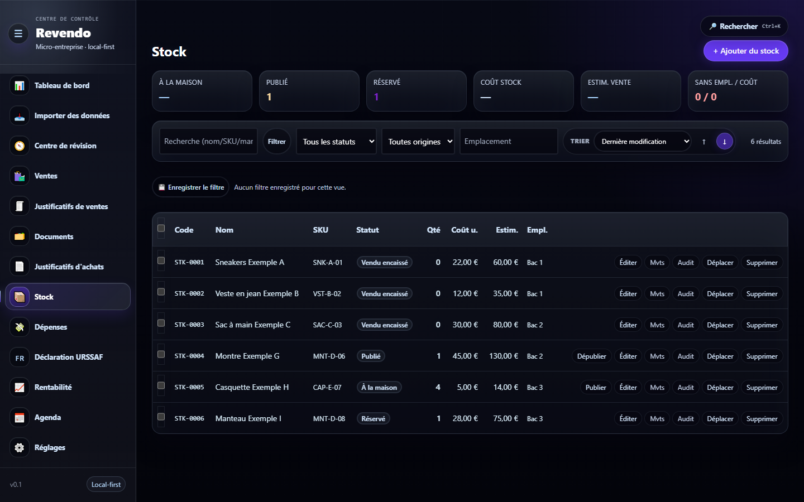
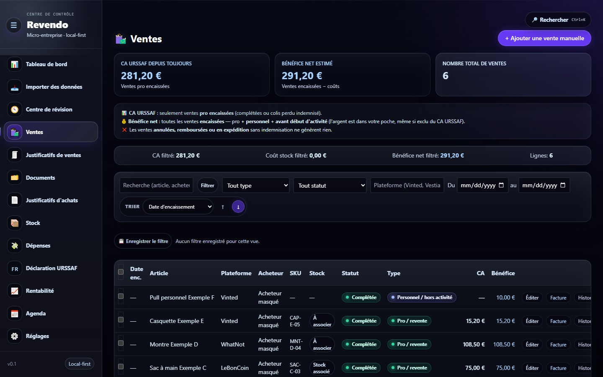
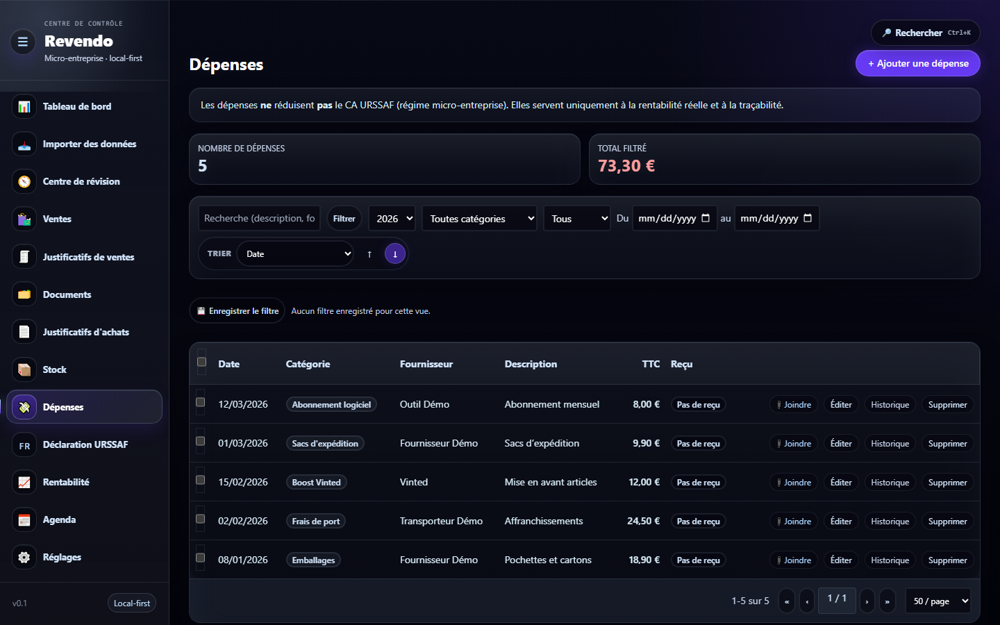
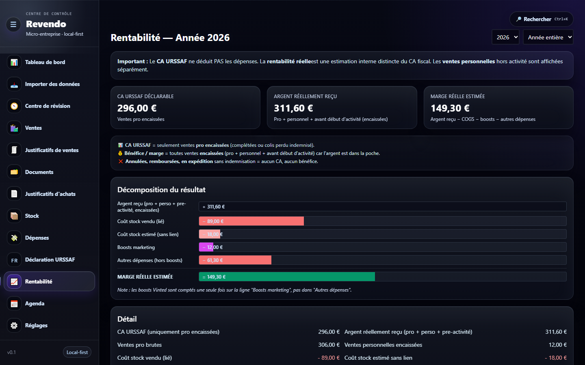
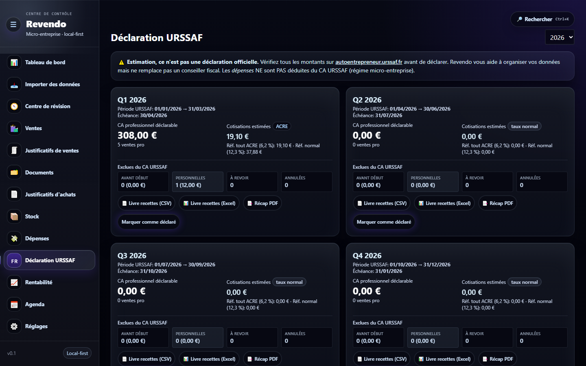

<div align="center">

# Revendo

### Application de gestion pour micro-entreprise de revente

**BETA — utilisée quotidiennement et en amélioration continue**

[](https://react.dev/)
[](https://www.typescriptlang.org/)
[](https://www.electronjs.org/)
[](https://www.sqlite.org/)
[](https://vite.dev/)
[](https://tailwindcss.com/)

</div>

Revendo est une application **desktop local-first** (Electron + SQLite) qui aide à gérer
une activité de revente multi-plateformes en micro-entreprise : suivi du chiffre
d'affaires, stock, réapprovisionnement, dépenses et **organisation de la déclaration
URSSAF**. Les données restent **sur la machine** ; rien n'est envoyé vers un serveur.

> 🔒 **Confidentialité.** La version publique ne contient **aucune donnée réelle**. Les
> exemples, le mode démo et les captures utilisent **uniquement des données fictives**.
> Revendo n'est ni un logiciel comptable certifié, ni un conseiller fiscal.

## 🌐 Démo web

L'application complète est un logiciel **desktop** (Electron + SQLite local) : Vercel ne
peut pas l'exécuter telle quelle. Une **démo web** est donc fournie — une vitrine
front-end qui rejoue les écrans principaux avec un **jeu de données fictives en mémoire**
(`src/demo/`). Certaines fonctions locales/desktop (import de fichiers, génération de PDF,
sauvegardes, chiffrement) **ne sont pas disponibles dans la démo web**.

- **Démo Vercel (données fictives) :** https://revendo.vercel.app

## 🖼️ Captures d'écran (données fictives)

| Tableau de bord | Stock |
| :-------------: | :---: |
|  |  |

| Ventes | Dépenses |
| :----: | :------: |
|  |  |

| Rentabilité | Déclaration URSSAF |
| :---------: | :----------------: |
|  |  |

## 🎯 Contexte du projet

J'ai créé Revendo pour répondre à un **besoin réel** : gérer ma micro-entreprise de
revente sans me noyer dans des tableurs. L'application réunit au même endroit les ventes
issues de plusieurs plateformes, le stock physique, les dépenses et la préparation des
échéances URSSAF, avec une logique fiscale codée et vérifiable.

## ✨ Fonctionnalités principales

- **Tableau de bord** : CA, bénéfice estimé, ventes, colis, échéances.
- **Suivi du chiffre d'affaires** et **calcul du CA URSSAF** trimestriel (sans déduire les
  dépenses), avec séparation ventes professionnelles / personnelles / pré-activité.
- **Aide à la déclaration URSSAF** : périodes, première déclaration combinée, taux
  ACRE/normaux configurables, exports (CSV, XLSX, PDF récap).
- **Gestion du stock** : articles, mouvements, statuts, emplacements, lots.
- **Réapprovisionnement / achats** et justificatifs d'achats.
- **Dépenses & boosts**, rentabilité par produit et par plateforme.
- **Imports** CSV/PDF depuis plusieurs marketplaces (Vinted, WhatNot, LeBonCoin…).
- **Documents & justificatifs**, registre des recettes, agenda iCal.
- **Données 100 % locales** (SQLite), sauvegardes, exports chiffrés optionnels, et une
  **PWA mobile** compagnon (dossier `mobile/`).

> ⚠️ Revendo aide à **organiser** et **estimer**. Avant toute déclaration officielle,
> vérifiez les montants sur [autoentrepreneur.urssaf.fr](https://www.autoentrepreneur.urssaf.fr/).

## 🧰 Technologies utilisées

**Front-end :** React 18, TypeScript, React Router, Vite, Tailwind CSS.
**Desktop / données :** Electron 32, better-sqlite3 (SQLite local-first), architecture IPC.
**Traitements :** zod (validation), dayjs, papaparse (CSV), exceljs (XLSX), pdf-parse (PDF/OCR), archiver (ZIP).
**Qualité :** Vitest (tests), ESLint, electron-builder (packaging Windows).

## 🚀 Installation locale

```bash
git clone https://github.com/ISURYDEV/revendo.git
cd revendo
npm install
```

> `better-sqlite3` est un module natif : `npm test` lance un rebuild Node automatique,
> et `npm run dev` un rebuild Electron automatique.

## 🛠️ Lancement en développement (application desktop)

```bash
npm run dev   # Vite + Electron
```

### Démo web (sans Electron)

```bash
npm run dev:vite     # http://localhost:5173 — mode démo à données fictives
# ou build statique :
npm run build:web    # génère dist/ (déployable sur Vercel)
```

## 📦 Build

```bash
npm run build        # typecheck + build web + build Electron
npm run package      # installeur Windows (NSIS) dans release/
```

## 🧪 Tests

```bash
npm test             # Vitest
```

Suite de **32 fichiers de tests** : parsers d'import, classification des ventes, périodes
URSSAF, stock et mouvements, rentabilité, sécurité/chiffrement, snapshots mobile, etc.

## 🗂️ Structure du projet

```
revendo/
├── src/                 # Front-end React (pages, composants, lib/api.ts = pont IPC)
│   └── demo/            # Backend de démonstration web (données fictives)
├── electron/            # Process principal Electron
│   ├── db/              #   SQLite : connexion + migrations (schéma)
│   ├── ipc/             #   handlers IPC
│   └── services/        #   logique métier (ventes, stock, URSSAF, imports, pdf, sécurité…)
├── shared/              # Types + noms de canaux IPC partagés
├── mobile/              # PWA mobile compagnon
├── tests/               # Tests Vitest
├── docs/screenshots/    # Captures (données fictives)
├── examples/demo-data.json
├── vercel.json · vite.config.ts · package.json
```

## 🔭 Limites actuelles

- Projet en **BETA** : fonctionnalités en évolution, pas de logiciel comptable certifié.
- La **démo web** ne reproduit que les écrans de consultation, avec données fictives ;
  imports/PDF/sauvegardes/chiffrement restent **desktop uniquement**.
- Packaging fourni pour **Windows** (Electron).

## 🛣️ Roadmap

- [ ] Déployer la démo web sur Vercel et l'enrichir.
- [ ] Étendre la couverture de tests et la CI.
- [ ] Améliorer la PWA mobile (saisie rapide hors-ligne).
- [ ] Builds macOS / Linux.

## 💼 Pour les recruteurs

Revendo démontre :

- la capacité à **créer une application répondant à un besoin réel** (de A à Z) ;
- le **développement React / TypeScript** et une **architecture front-end** structurée ;
- une **logique métier** non triviale (règles fiscales URSSAF, classification, rentabilité) ;
- la **gestion de données locales** (SQLite local-first, IPC Electron, migrations) ;
- des **tableaux de bord** et une UX soignée ;
- des **tests** automatisés et une **documentation** claire ;
- du **sens produit** et de l'**autonomie** ;
- l'usage d'outils d'IA de développement (Claude Code / Codex) pour **accélérer** un projet
  exigeant, **sans se substituer** à la compréhension de l'architecture et du métier.

## 🔐 Confidentialité

Aucune donnée réelle d'activité (CA, stock, prix, clients, fournisseurs, déclarations) n'est
présente dans ce dépôt. Les vraies données vivent uniquement en local
(`%APPDATA%\Revendo\…`) et sont exclues par `.gitignore`. Le mode démo et les captures
n'utilisent que des données **fictives**.

---

_Projet personnel — Tous droits réservés, sauf mention contraire._
